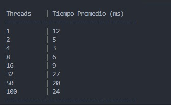
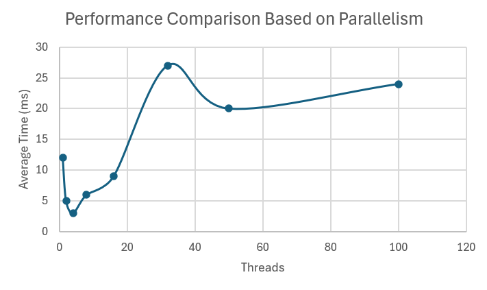

# Blacklist Search API - Threading Laboratory

A comprehensive Spring Boot application demonstrating advanced threading concepts in Java through a real-world IP blacklist validation system. This laboratory project implements parallel search algorithms using both traditional Java threads and virtual threads to validate IP addresses against thousands of blacklist servers.

## Getting Started

This laboratory project explores threading concepts including thread lifecycle, parallel processing, performance evaluation, and early termination strategies. The application provides a REST API for IP validation while demonstrating various threading techniques and their performance implications in the context of cybersecurity monitoring systems.

### Prerequisites

Before running this project, ensure you have the following installed:

- **Java 17** or higher
- **Maven 3.9+** for dependency management and build automation
- **Git** for version control
- **jVisualVM** (optional) for performance monitoring

```bash
# Verify Java version
java -version
# Expected: openjdk version "17.x.x" or higher

# Verify Maven version
mvn -version
# Expected: Apache Maven 3.9.x or higher
```

### Installing

Follow these step-by-step instructions to get the development environment running:

1. **Clone the repository**
```bash
git clone https://github.com/ARSW-PANDILLA-2025/Lab_Threads_BlackList_API.git
cd Lab_Threads_BlackList_API
```

2. **Install dependencies and compile**
```bash
mvn clean compile
```

3. **Run the tests to ensure everything is working**
```bash
mvn test
```

4. **Build the executable .jar in target/**
```bash
mvn clean package
```

5. **You can start the application, but there is no Front End**
```bash
mvn spring-boot:run
```

The application will be available at `http://localhost:8080`

**Example API call to verify installation:**
```bash
curl "http://localhost:8080/api/v1/blacklist/check?ip=200.24.34.55&threads=4"
```

Expected response:
```json
{
  "ip": "200.24.34.55",
  "trustworthy": false,
  "matches": [0, 1, 2, 3, 4, 5, 6, 7, 8, 9],
  "checkedServers": 123,
  "totalServers": 10000,
  "elapsedMs": 7,
  "threads": 4
}
```

## Running the Tests

The project includes comprehensive test suites organized by laboratory activities. Each test demonstrates specific threading concepts and validates implementation correctness.

### Test Organization by Activities

```bash
# Run all tests
mvn test

# Run specific test suites by laboratory parts
mvn test -Dtest=Test1CountThreadTest                    # Part I: Basic Threading
mvn test -Dtest=Test2BlacklistChecker2Test              # Part II: Parallel Search (Traditional Threads)
mvn test -Dtest=Test3SpecificIPsTest                    # Part II: IP-specific Analysis & Performance
mvn test -Dtest=Test4PerformanceEvaluation              # Part III: Performance Analysis
mvn test -Dtest=BlacklistCheckerTest                    # Integration Tests (Main Implementation)
mvn test -Dtest=BlacklistControllerTest                 # API REST Tests
```

### Complete Test Suite Structure

**Laboratory Tests:**
- `Test1CountThreadTest` (11 tests) - Basic threading concepts in `part1` package
- `Test2BlacklistChecker2Test` (5 tests) - Traditional thread implementation in `part2.activity2` package  
- `Test3SpecificIPsTest` (8 tests) - IP-specific behavior analysis with comprehensive logging in `part2.activity3` package
- `Test4PerformanceEvaluation` (4 tests) - Threading performance evaluation in `part3` package

**System Tests:**
- `BlacklistCheckerTest` (1 test) - Integration testing of main virtual threads implementation
- `BlacklistControllerTest` (2 tests) - REST API endpoint validation

### Test Coverage by Threading Concepts

**Thread Fundamentals (Test 1):**
```bash
# Basic thread lifecycle and behavior
mvn test -Dtest=Test1CountThreadTest#test1_1_shouldCreateThreadWithCorrectName
mvn test -Dtest=Test1CountThreadTest#test1_5_shouldShowDifferenceBetweenStartAndRun
```

**Traditional Threading Implementation (Test 2):**
```bash
# BlacklistChecker2 with classic Thread class
mvn test -Dtest=Test2BlacklistChecker2Test#shouldImplementCompleteCheckHostLogic
mvn test -Dtest=Test2BlacklistChecker2Test#shouldWorkWithMultipleThreadsOnDifferentSegments
mvn test -Dtest=Test2BlacklistChecker2Test#shouldMaintainThreadSafetyInResults
```

**IP-Specific Performance Analysis (Test 3):**
```bash
# Concentrated, dispersed, and clean IP behavior
mvn test -Dtest=Test3SpecificIPsTest#test3_1_shouldDetectConcentratedIPQuickly
mvn test -Dtest=Test3SpecificIPsTest#test3_2_shouldHandleDispersedIPCorrectly
mvn test -Dtest=Test3SpecificIPsTest#test3_3_shouldHandleCleanIPWorstCase
mvn test -Dtest=Test3SpecificIPsTest#test3_8_comprehensivePerformanceAnalysisWithLogging
```

**Threading Scalability Testing (Test 4):**
```bash
# Performance impact of thread count configurations
mvn test -Dtest=Test4PerformanceEvaluation#test4_completePerformanceEvaluation
mvn test -Dtest=Test4PerformanceEvaluation#test4_1_baselineWithSingleThread
mvn test -Dtest=Test4PerformanceEvaluation#test4_2_optimalWithPhysicalCores
mvn test -Dtest=Test4PerformanceEvaluation#test4_3_highConcurrencyWith100Threads
```

**System Integration (Test 4 & 5):**
```bash
# Main implementation with virtual threads
mvn test -Dtest=BlacklistCheckerTest#test4_1_earlyStopShouldAvoidScanningAllServers

# REST API validation
mvn test -Dtest=BlacklistControllerTest#test5_1_shouldReturn200ForValidIPv4
mvn test -Dtest=BlacklistControllerTest#test5_2_shouldReturn400ForInvalidIPv4
```

### Break down into end to end tests

**Test 1 (Part I) - Basic Threading Concepts**
Tests the fundamental difference between `start()` and `run()` methods, thread naming, and concurrent execution patterns.

```bash
mvn test -Dtest=Test1CountThreadTest#test1_5_shouldShowDifferenceBetweenStartAndRun
```
*This test demonstrates why `start()` creates parallel execution while `run()` executes sequentially.*

**Test 2 (Part II) - Traditional Thread Implementation**
Validates the implementation of parallel search using classic Java Thread class, including segment division, thread synchronization, and result aggregation.

```bash
mvn test -Dtest=Test2BlacklistChecker2Test#shouldImplementCompleteCheckHostLogic
```
*Tests complete parallel implementation with BlacklistChecker2 including server division, early stopping, and thread safety.*

**Test 3 (Part II) - IP-Specific Behavior Analysis**
Comprehensive testing of different IP patterns to demonstrate various search scenarios: concentrated matches, dispersed matches, and no matches.

```bash
mvn test -Dtest=Test3SpecificIPsTest#test3_8_comprehensivePerformanceAnalysisWithLogging
```
*Executes detailed performance analysis with logging for the three specific test IPs across multiple thread configurations.*

**Test 4 (Part III) - Performance Evaluation**
Comprehensive performance testing with different thread configurations (1, physical cores, 2x cores, 50, 100 threads) to analyze scalability and identify optimal threading strategies.

```bash
mvn test -Dtest=Test4PerformanceEvaluation#test4_completePerformanceEvaluation
```
*Analyzes performance impact of thread count using dispersed IP (202.24.34.55) with detailed comparative and scalability analysis.*

### Laboratory Test IP Cases

The project includes three specific test cases that demonstrate different algorithmic behaviors:

- **200.24.34.55** (Concentrated): Matches found in early servers (0-9) - demonstrates effective early stopping
- **202.24.34.55** (Dispersed): Matches spread across servers (5, 111, 999, 2048, 4096, 8191) - moderate early stopping
- **212.24.24.55** (Clean): No matches found - worst case scenario requiring full server scan

### Test Package Structure

```
src/test/java/
├── co/eci/blacklist/labs/part1/
│   └── Test1CountThreadTest.java           # Basic threading (11 tests)
├── co/eci/blacklist/labs/part2/activity2/
│   └── Test2BlacklistChecker2Test.java     # Traditional threads (5 tests)
├── co/eci/blacklist/labs/part2/activity3/
│   └── Test3SpecificIPsTest.java           # IP-specific analysis (8 tests)
├── co/eci/blacklist/labs/part3/
│   └── Test4PerformanceEvaluation.java     # Performance evaluation (4 tests)
├── co/eci/blacklist/domain/
│   └── BlacklistCheckerTest.java           # Integration tests (1 test)
└── co/eci/blacklist/api/
    └── BlacklistControllerTest.java        # API tests (2 tests)
```

**Total Test Coverage: 31 tests across 6 test classes**

## Performance Monitoring

### Using jVisualVM for Performance Analysis

1. **Start the application:**
```bash
mvn spring-boot:run
```


2. **Launch jVisualVM and connect to the running application**


3. **Execute performance tests with different configurations:**
```bash
# Single thread baseline
curl "http://localhost:8080/api/v1/blacklist/check?ip=202.24.34.55&threads=1"

# Optimal configuration (physical cores)
curl "http://localhost:8080/api/v1/blacklist/check?ip=202.24.34.55&threads=6"

# High concurrency test
curl "http://localhost:8080/api/v1/blacklist/check?ip=202.24.34.55&threads=100"
```


4. **Monitor CPU usage, memory consumption, and thread activity**


5. **Record the execution times**


### 📈 Analysis of results

Using the data collected, plot a graph with:

- **X-axis:** number of threads
- **Y-axis:** execution time (ms)



### 📉 Graph



### Questions

1. According to Amdahl's Law, why is the best performance not achieved with hundreds of threads (e.g., 500)?

The maximum acceleration is limited by the sequential part of the program.

As N increases, there comes a point where overhead (thread creation/planning, synchronization, lock contention, cache misses) dominates.

Hardware limits also come into play: number of physical cores, memory bandwidth, and I/O.
Result: after a certain N, the time stops decreasing and even worsens.

2. What happens when using number of threads = cores vs. twice the number of cores?

With N ≈ cores, each thread can run without much competition → good performance.

With N = 2× cores, there is over-subscription: more threads than “seats.” The OS switches context more often, increasing cache latency and overhead; sometimes it improves little or worsens.

3. What would happen if, instead of a single computer, the work were distributed across 100 machines with one thread each? Would performance improve? How does the parallelizable fraction (P) of the problem influence this?

It could improve if the problem is highly parallelizable (P ~ 1) and if the distribution/communication overhead is low (network, coordination, data partitioning).

If P is moderate/low or communication costs are high, the gain stagnates (again Amdahl): the sequential part and inter-node coordination limit acceleration.

## Deployment

### Local Development
```bash
mvn spring-boot:run
# Application available at http://localhost:8080
```

### Production JAR
```bash
mvn clean package -DskipTests
java -jar target/blacklist-api-0.0.1-SNAPSHOT.jar
```

### Docker Deployment
```bash
# Build Docker image
docker build -t blacklist-api:latest .

# Run container
docker run --rm -p 8080:8080 blacklist-api:latest

# With performance monitoring
docker run --rm -p 8080:8080 \
  -e JAVA_OPTS="-Xmx2g -XX:+UseG1GC -XX:+UseStringDeduplication" \
  blacklist-api:latest
```

### Environment Configuration
Key environment variables for deployment:

```bash
# Application settings
SPRING_PROFILES_ACTIVE=production
SERVER_PORT=8080
BLACKLIST_ALARM_COUNT=5

# Performance tuning for threading
JAVA_OPTS="-Xmx2g -XX:+UseG1GC -XX:MaxGCPauseMillis=100"
```

## Built With

* **[Spring Boot 3.x](https://spring.io/projects/spring-boot)** - Application framework and REST API
* **[Java 17](https://openjdk.org/projects/jdk/17/)** - Programming language with Virtual Threads support
* **[Maven](https://maven.apache.org/)** - Dependency management and build automation
* **[JUnit 5](https://junit.org/junit5/)** - Testing framework for unit and integration tests
* **[Spring Boot Actuator](https://docs.spring.io/spring-boot/docs/current/reference/html/actuator.html)** - Application monitoring and metrics
* **[SLF4J + Logback](https://logback.qos.ch/)** - Structured logging framework
* **[Jackson](https://github.com/FasterXML/jackson)** - JSON processing for REST API

## Project Structure

```
src/
├── main/
│   ├── java/co/eci/blacklist/
│   │   ├── BlacklistApiApplication.java         # Spring Boot main application class
│   │   ├── api/                                # REST API Layer
│   │   │   ├── BlacklistController.java        # Main REST endpoint controller
│   │   │   └── dto/
│   │   │       └── CheckResponseDTO.java       # API response data transfer object
│   │   ├── application/                        # Application Service Layer
│   │   │   └── BlacklistService.java           # Business logic coordination service
│   │   ├── domain/                            # Core Domain Logic
│   │   │   ├── BlacklistChecker.java          # Main parallel processing engine (Virtual Threads)
│   │   │   ├── MatchResult.java               # Domain result encapsulation
│   │   │   └── Policies.java                  # Business rules and configuration
│   │   ├── infrastructure/                    # Infrastructure & External Dependencies
│   │   │   ├── DataSourceConfig.java          # Data source configuration
│   │   │   └── HostBlackListsDataSourceFacade.java  # Blacklist servers facade
│   │   └── labs/                             # Laboratory Exercise Implementations
│   │       ├── part1/                        # Part I: Basic Threading Concepts
│   │       │   ├── CountThread.java          # Thread class extension example
│   │       │   └── CountMainThreads.java     # Thread coordination and execution
│   │       └── part2/                        # Part II: Parallel Search Implementation
│   │           └── BlacklistChecker2.java    # Traditional Thread-based implementation
│   └── resources/
│       ├── application.yaml                  # Spring Boot configuration
│       └── META-INF/
│           └── additional-spring-configuration-metadata.json
└── test/
    └── java/co/eci/blacklist/
        ├── api/                              # API Layer Tests
        │   └── BlacklistControllerTest.java  # REST endpoint integration tests
        ├── domain/                           # Domain Layer Tests
        │   └── BlacklistCheckerTest.java     # Main implementation integration tests
        └── labs/                            # Laboratory Exercise Tests
            ├── part2/                       # Part II Testing
            │   ├── activity2/               # Activity 2: Traditional Threading
            │   │   └── Test2BlacklistChecker2Test.java  # Traditional thread implementation tests
            │   └── activity3/               # Activity 3: IP-Specific Analysis
            │       └── Test3SpecificIPsTest.java        # IP behavior and performance tests
            └── part3/                       # Part III Testing
                └── Test4PerformanceEvaluation.java      # Threading performance analysis tests
```

## API Endpoints

### Main Blacklist Validation
- **GET** `/api/v1/blacklist/check?ip={ipv4}&threads={n}`
  - Validates IP against blacklist servers using specified thread count
  - Returns detailed results including performance metrics
  - **Parameters:**
    - `ip`: IPv4 address to validate (required)
    - `threads`: Number of threads to use (optional, default: available processors)

### Health & Monitoring
- **GET** `/actuator/health` - Application health check
- **GET** `/actuator/metrics` - Application performance metrics
- **GET** `/actuator/info` - Application information

### Example API Usage
```bash
# Basic validation with default threading
curl "http://localhost:8080/api/v1/blacklist/check?ip=200.24.34.55"

# Performance comparison with different thread counts
curl "http://localhost:8080/api/v1/blacklist/check?ip=202.24.34.55&threads=1"
curl "http://localhost:8080/api/v1/blacklist/check?ip=202.24.34.55&threads=6"
curl "http://localhost:8080/api/v1/blacklist/check?ip=202.24.34.55&threads=12"
```

---

## 📄 Licencia

## Threading Concepts Demonstrated

### Part I - Fundamental Threading Concepts
- **Thread Creation**: Extending Thread class vs implementing Runnable
- **Thread Lifecycle**: Creation, execution, and termination
- **Thread Coordination**: Using `join()` for synchronization
- **Critical Difference**: `start()` vs `run()` method execution

### Part II - Parallel Processing Implementation
- **Work Division**: Segmenting servers across multiple threads
- **Load Balancing**: Even distribution with remainder handling
- **Thread Safety**: Atomic operations and synchronized collections
- **Early Termination**: Threshold-based processing interruption
- **Result Aggregation**: Combining partial results from worker threads

### Part III - Performance Analysis and Optimization
- **Scalability Testing**: Thread count vs performance correlation
- **Amdahl's Law**: Practical demonstration of parallel speedup limits
- **Resource Utilization**: CPU and memory usage patterns
- **Optimal Configuration**: Identifying best thread count for given workload

## Contributing

We welcome contributions to improve the threading implementations and educational value of this laboratory project.

1. **Fork the repository**
2. **Create a feature branch** (`git checkout -b feature/threading-enhancement`)
3. **Follow coding standards** and add comprehensive tests
4. **Commit changes** (`git commit -m 'Add enhanced threading feature'`)
5. **Push to branch** (`git push origin feature/threading-enhancement`)
6. **Open a Pull Request**

### Development Guidelines
- Follow Java naming conventions and code style
- Add JavaDoc comments for public methods and classes
- Include comprehensive unit tests for new functionality
- Ensure thread safety for all concurrent operations
- Document performance implications of changes
- Maintain backward compatibility with existing API

## Versioning

We use [Semantic Versioning](http://semver.org/) for version management. Current version: **1.0.0**

Version History:
- **1.0.0** - Complete threading laboratory implementation with all parts
- **0.4.0** - Performance evaluation framework (Part III)
- **0.3.0** - IP-specific testing and comprehensive analysis
- **0.2.0** - Parallel search implementation (Part II)
- **0.1.0** - Basic threading concepts implementation (Part I)

## Authors

**Laboratory Development Team - ARSW-PANDILLA-2025**

* **Javier Iván Toquica Barrera** - *Teacher*
* **Juan Felipe Alfonso Martínez** - *Student 1*
* **Santiago Andrés Arteaga Gutiérrez** - *Student 2*
* **Cristian David Polo Garrido** - *Student 3*
* **Angie Julieth Ramos Cortés** - *Student 4*

**Academic Institution:** Escuela Colombiana de Ingeniería Julio Garavito <br>
**Course:** Arquitectura de Software (ARSW) <br>
**Academic Period:** 2025-II

## Performance Insights and Key Findings

### Laboratory Results Analysis

**Optimal Threading Configuration:**
- **Best Performance**: 6-12 threads (1-2x physical cores) for the test system
- **Diminishing Returns**: Beyond 50 threads, performance gains plateau
- **Memory Trade-off**: Each additional thread increases memory usage ~7MB
- **Early Termination Effectiveness**: Reduces execution time by 60-95% depending on IP pattern

### Amdahl's Law in Practice
Real-world validation of parallel processing limitations:
- **Parallel Fraction (P)**: ~92% of blacklist checking work can be parallelized
- **Sequential Bottleneck**: Result aggregation and API response formatting
- **Maximum Theoretical Speedup**: ~12.5x (limited by sequential components)
- **Observed Speedup**: ~5.5x (accounting for thread overhead and coordination)

### Thread Count Recommendations
Based on Intel i5-11400F (6 cores, 12 threads) testing:

| Use Case | Recommended Threads | Rationale |
|----------|-------------------|-----------|
| Development | 4 | Good performance without resource exhaustion |
| Production | 6-8 | Optimal balance of speed and resource usage |
| High Load | 12 | Maximum performance for sustained workload |
| Batch Processing | 16-20 | Acceptable for batch jobs with memory monitoring |

## Educational Outcomes

This laboratory successfully demonstrates:

1. **Threading Fundamentals**: Practical understanding of Java thread management
2. **Parallel Algorithm Design**: Implementation of effective work distribution strategies
3. **Performance Analysis**: Empirical evaluation of threading efficiency
4. **Synchronization Techniques**: Thread-safe programming practices
5. **System Optimization**: Identification of optimal configurations for parallel workloads

## License

This project is licensed under the MIT License - see the [LICENSE.md](LICENSE.md) file for details.

## Acknowledgments

* **Java Concurrency in Practice** - Inspiration for thread-safe design patterns
* **Spring Boot Team** - Excellent framework for building production-ready applications
* **OpenJDK Project** - Virtual Threads and modern concurrency features
* **Academic Community** - Threading concepts and parallel algorithm research
* **Performance Testing Tools** - jVisualVM, JConsole, and profiling methodologies
* **Escuela Colombiana de Ingeniería** - Academic support and computing resources

---

## Quick Start Commands

```bash
# Complete setup and test execution
git clone https://github.com/ARSW-PANDILLA-2025/Lab_Threads_BlackList_API.git
cd Lab_Threads_BlackList_API
mvn clean test
mvn spring-boot:run

# Comprehensive performance analysis
mvn test -Dtest=Test4PerformanceEvaluation#test4_1_completePerformanceEvaluation

# API performance testing
curl "http://localhost:8080/api/v1/blacklist/check?ip=200.24.34.55&threads=1"
curl "http://localhost:8080/api/v1/blacklist/check?ip=202.24.34.55&threads=6"
curl "http://localhost:8080/api/v1/blacklist/check?ip=212.24.24.55&threads=12"
```

**¡Explore the fascinating world of concurrent programming! 🧵✨**
